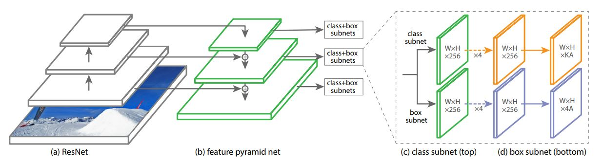
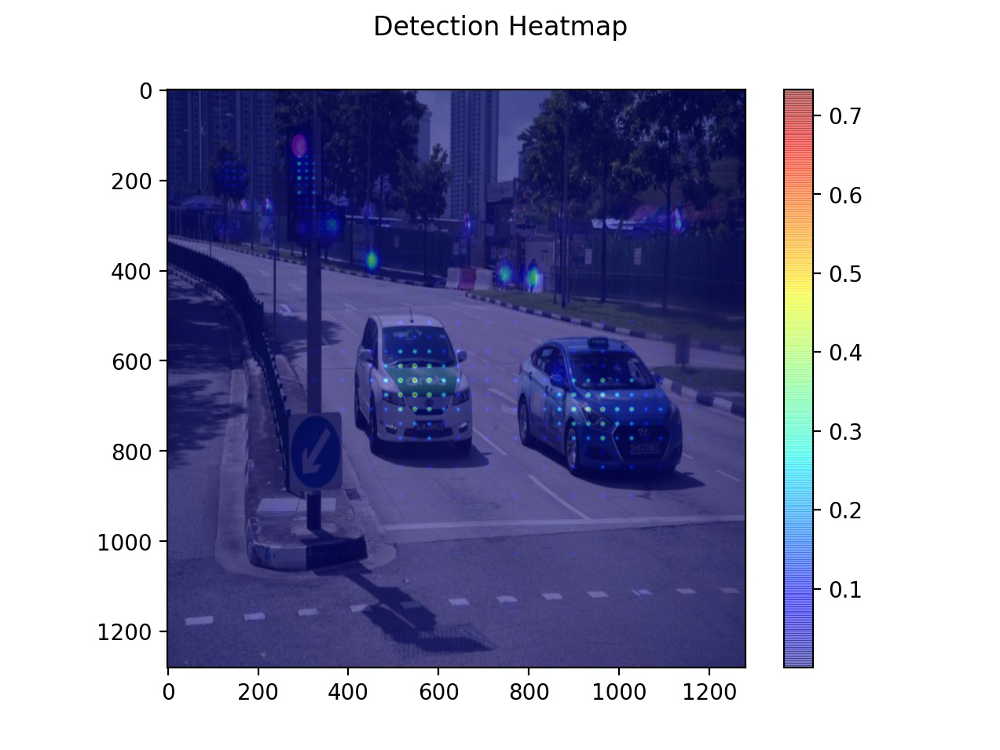
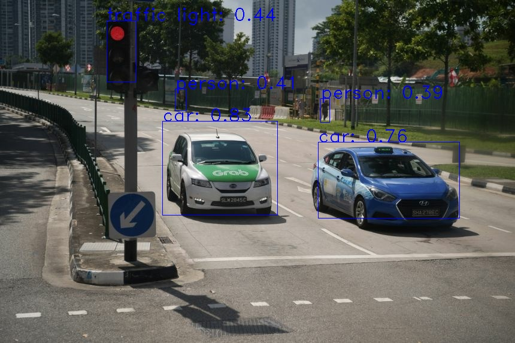

# CV-RetinaNet
This repository contains the codes for the implementation of [RetinaNet](https://arxiv.org/abs/1708.02002). RetinaNet is one-stage object detection model with the architecture as shown in Fig. 1. There are 2 minor differences between this implementation and that in the paper, the first being that the input image is scaled to a resolution of 1280 by 1280, and the second being that 4 anchor scales (0.75, 1.0, 1.5 and 2.0) were used instead of 3. In addition, this implementation uses SGD instead of SGDW when training the model.


Fig. 1: Architecture of RetinaNet model as shown in the [paper](https://arxiv.org/abs/1708.02002).

## Training the Model
To train the RetinaNet, first process the COCO data
```
python format_COCO_fcos.py
```
to normalise the bounding boxes with respect to the image dimensions. Next, run
```
python train_retinanet_coco.py
```
to train the RetinaNet model. Finally, 
```
python infer_retinanet_coco.py -s true -r 1280 -i Results/taxi_image.jpg
```
to perform inference. 

## Pre-Trained Model
The pre-trained RetinaNet COCO model could be downloaded at the following [link](https://github.com/WD-Leong/CV-RetinaNet/releases/download/v1/coco_retinanet_resnet101_1280.zip). 

## Detection Results in the Wild
The detection results in the wild are shown in Table 1.

| Detection Heatmap  | Detection Results |
| ------------------ | ----------------- |
|  |  |

## Enhancements
The codes for RefineDet are provided.
